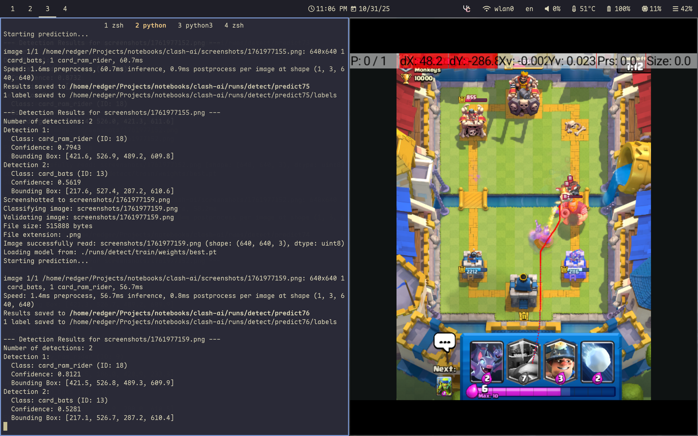
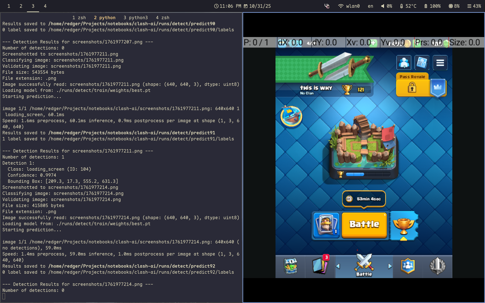
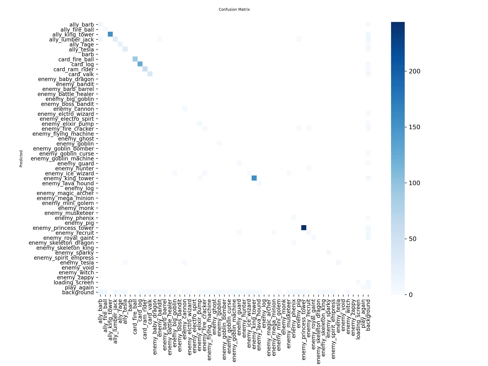
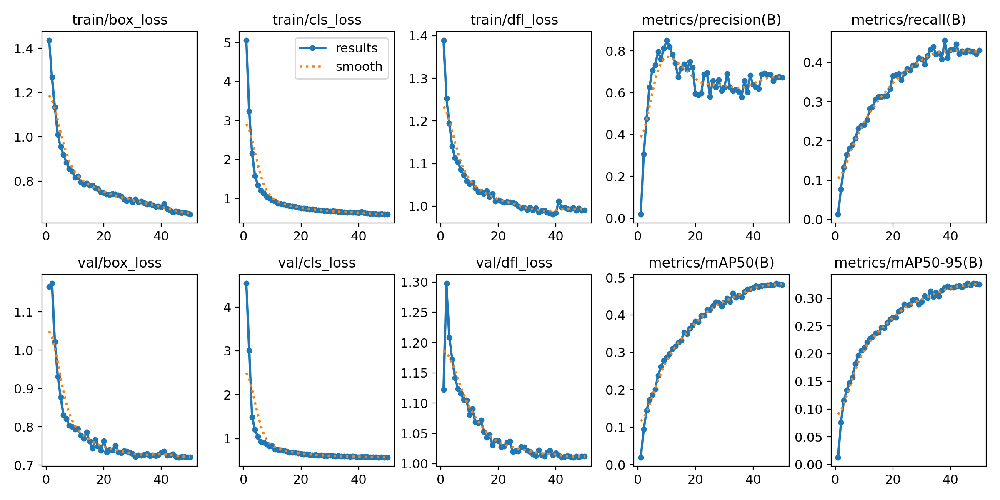

# Clash Royale Bot
## Setup

### Dependencies

- An Android emulator using [ADB](https://developer.android.com/tools/adb) with Clash Royale installed
- The [`uv`](https://docs.astral.sh/uv/) package manager

### Installation

1. Setup a virtual environment and activate it: `uv venv && source .venv/bin/activate`
2. Install `pip` dependencies: `uv sync`
3. Run the setup script to download the Roboflow model. This will prompt for your Roboflow API key: `python3 setup.py`

## Trimester 1 Milestone

### Usage

There are two files that can be run in this project - `main.py` and `model.py`.

- `model.py`
  - To train the model, run `python model.py --mode train --device 0`. Alternatively, use `--device cpu` if there is no CUDA GPU available. Note that this will be extremely slow.
    - Training will not be necessary if the `runs.zip` file has been setup properly
  - To classify an image after training, run `python model.py --mode classify --model ./runs/detect/train/weights/best.pt --image <image_path>`
  - For more configuration options, run `python model.py --help`
  - **Note:** the current dataset is intended to be placeholder while I collect/label data

- `main.py`
  - Simply run `python main.py` after opening Clash Royale on the emulator
  - The program takes a screenshot every 2 seconds and sends it through the classifier.

### Examples and Figures

